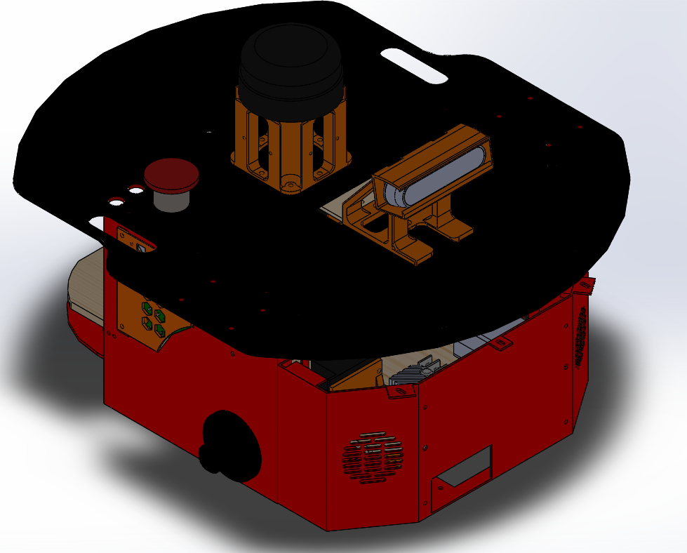
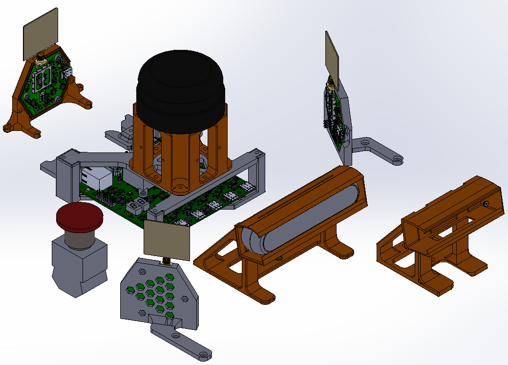
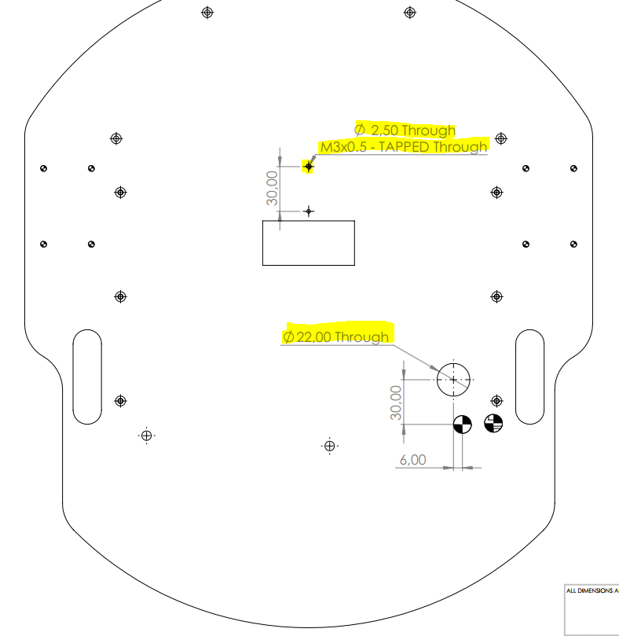
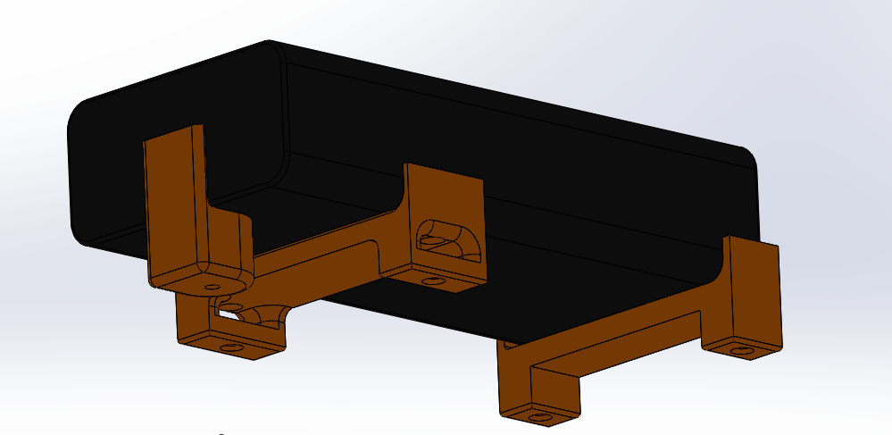
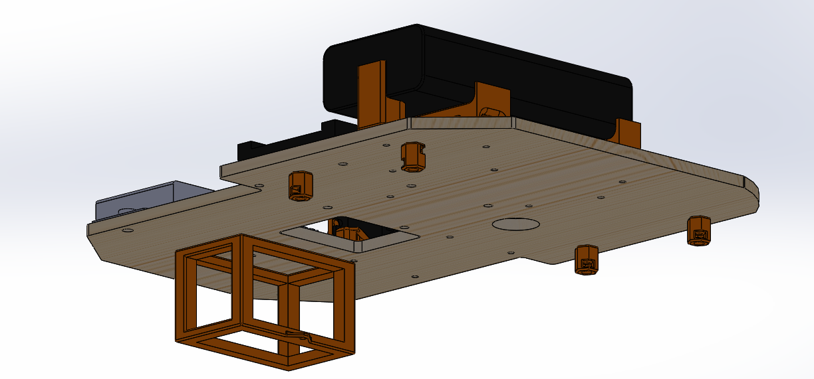
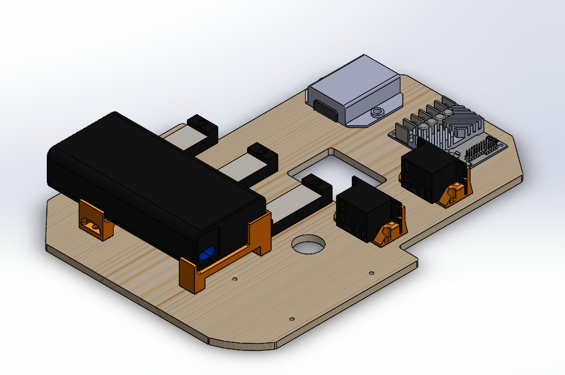
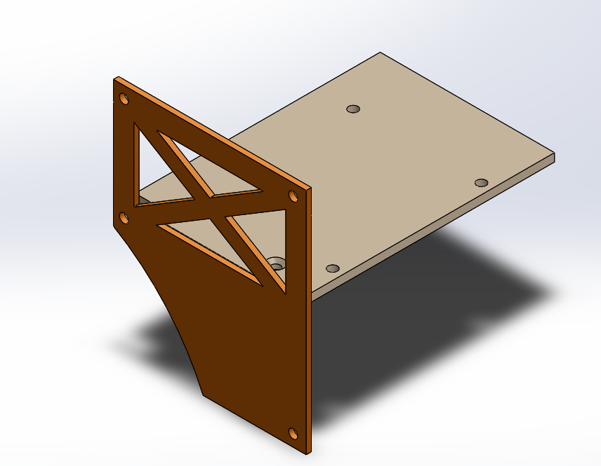
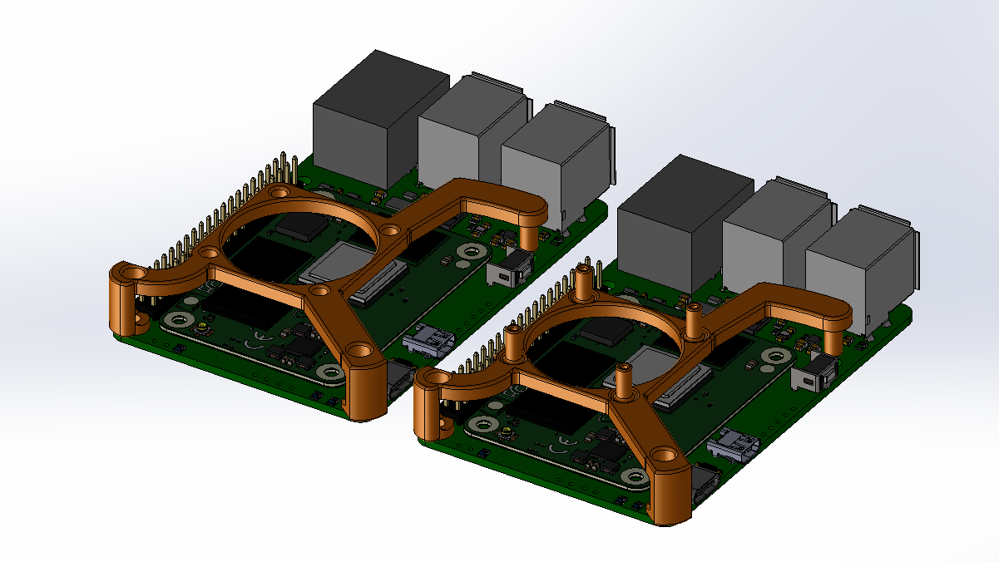
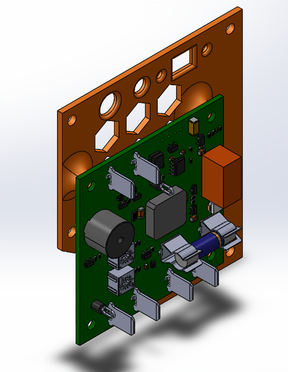

# Pioneer-Mechanical-Update

This repository contains the 3D model of a modified Pioneer 2-DX used by the SwarmUS project.

## Requirements
- Solidworks 2021

## Getting started

This repository contains submodule of 3D model parts. Right after cloning the project and prior to opening any assembly, run the following command:

```
git submodule update --init --recursive
```

### Repository structure

------

```
Pioneer-Mechanical-Update
├── outputs
│   ├── dxf
|   ├── pdf
│   └── STL
|   	├── external
│   	└── internal
├── external
├── internal
├── Pioneer_originalRobotBase
├── pioneer2DX.SLDASM
└── README.md
```

#### pioneer2DX.SLDASM

Main assembly of the modified pioneer. It's composed of a Pioneer 3Dx chassis (which is the same as the Pioneer 2Dx) get from *Pioneer_originalRobotBase*, of components that are external to the robot (*external*) and of components that are internal to the robot (*internal*).

In this assembly, the Realsense D435i and its support are used but an additional models were made to use a D455 instead. The D455 version is include in assembly in hidden mode. 

Note: The wheels and the front sonar array are not included in the assembly since they are not useful to the sensors and electronics layouts. 



### external

Contains the 3D models of the external components and their supports



- **D435i**
  - **D435i_case.sldprt**: Realsense D435i protective case
  - **Intel_RealSense_Depth_Camera_D435.SLDASM**: 3D model of the camera distributed by Realsense [CAD Files (intelrealsense.com)](https://dev.intelrealsense.com/docs/cad-files)
  - **D435i_support.sldprt**: Camera stand that fits on the bolt pattern of the pioneer's top plate. The protective case is compatible with the support.
  - **D435i.SLDASM**: Assembly of the camera, its protective case and its support.
  - **protected_D435i.SLDASM**: Assembly of the camera and its protective case.
  
- **D455**
  
  - **D455_case.sldprt**: Realsense D455 protective case
  - **Intel_RealSense_D455_CAD_external_v2.SLDASM**: 3D model of the camera distributed by Realsense [CAD Files (intelrealsense.com)](https://dev.intelrealsense.com/docs/cad-files)
  - **D455_support.sldprt**: Camera stand that fits on the bolt pattern of the pioneer's top plate. The protective case is compatible with the support.
  - **D455_assembly.SLDASM**: Assembly of the camera, its protective  case and its support.
  - **protected_D455.SLDASM**: Assembly of the camera and its protective case.
  
- **motor_stop.SLDPRT**
  
  - Cad of the mushroom button used to disconnect the motor's power. Is mounted in a 22mm hole on the Pioneer's top plate.
  
- **Lidar**
  - **rplidar_simplified.SLDPRT**: 3D model of a simplified Rplidar A2M8.
  - **lidar_support_april_tags.SLDPRT**: Lidar stand. We reused the already present bolt partern on the top plate of our Pionneer 2Dx to save time. The sides were designed to install a plate or sheet with AprilTags on them.

- **top_plate_modifications.SLDDRW**: Drawings of the additional holes that needs to be drilled on the Pioneer's top plate. One hole is for the mushroom button and the other one is an M3X0.5 tapped hole for the camera support. 

  

-**Board supports**

  - **HB_Plate.SLDPRT**: support the Hiveboard under the lidar.
  - **pionneer_bbmount_droit.SLDPRT**: supports the beeboard on the right side of the pionneer.
  - **pionneer_bbmount_gauche.SLDPRT**: supports the beeboard on the left side of the pionneer.  
  - **Lidar_support_over_HB.SLDPRT** support for lider over the Hiveboard. All holes are for M3 screws and nuts.


### internal

Contains the 3D models of the internal components, their supports and big support plate.

- **Battery**

  

  - **GOOLOO.SLDPRT**: Model of the battery. It's placed at the back of the robot since its the most accessible place to remove it and recharge it. 
  - **battery_holder_center.SLDPRT** , **battery_holder_side.SLDPRT** and **battery_stopper**: supports fixed on the internal plate. The battery sits in the supports to block its motion. An additional velcro strip can be installed in the middle support to strap the battery thus preventing it from moving up and down.

- **Support plate**

  

  - **internal_support_plate_hole.SLDPRT** : Laser cut plate used to screw the components in place.
  - **small_plate_support.SLDPRT**: Small stands used to support the plate near the back of the robot. There are 4 of them and they are screwed on the bolt pattern of the bottom plate of the robot's chassis.
  
- **internal_electronics_plate.SLDASM**: Assembly of the circuits components and the support plate.

  

  - **bornier.SLDPRT**: Screw terminals block.
  - **REG_313080006.SLDPRT**: 313080006 5V regulator
  - **Relays**
    - **relay.SLDPRT**: Relay
    - **relay_bracket.SLDPRT**: Bracket to hold the relay at a 90 degrees angle. This help with the electrical harness.
    - **relay_assembly.SLDASM**: Assembly of the relay and its bracket
  - **roboclaw_2X30A.SLDASM**: Motor controller CAD. Available at : [RoboClaw 2x30A Motor Controller (basicmicro.com)](https://www.basicmicro.com/RoboClaw-2x30A-Motor-Controller_p_9.html)

  

- **Computer's side pannel**

  

  - **computer.SLDPRT**: Box that represents the footprint of  Raspberry Pi 4 and a Jetson Nano ( sizes of their longest side with height of a Jetson). The CAD of the Raspberry Pi 4 is very heavy to load so this box is used as a lighter representation.

  - **side_pannel.SLDPRT**: Model of a panel that can be installed on the left-side slot of the pioneer to support a small plate. In our case, we used is to support the computer.

  - **computer_support.SLDPRT**: Plate that can be screwed on the *side_pannel.SLDPRT* . It has the bolt pattern to install a Rasberry Pi 4 or a Jeston Nano.

  - **computer_support_pi.SLDPRT**: Plate that can be screwed on the *side_pannel.SLDPRT* . It has the bolt pattern to install a Rasberry Pi 4. Was designed to have a more compact plate the selected computer is the Raspberry Pi 4. 

  - **supported_pi.SLDASM**: Assembly of the side pannel and the Raspberry Pi 4 support plate.

  - **fan_support.SLDPRT**: Support for the 5V fan that comes with the [LABIST Raspberry Pi 4 case]([LABISTS Case for Raspberry Pi 4](https://labists.com/products/raspberry-pi-4-case-kit)). Uses the screws provided with the kit.

  - **fan_support_m3.SLDPRT**: Support for the 5V [CANAKIT Pi fan](https://www.canakit.com/raspberry-pi-fan.html). Screwed with M3 fasteners.

    

  **Under Voltage Lock Out's (UVLO) side pannel**

  

  - **UVLO_MODULE_PCB REV Project_PCB_Rev.SLDASM**: CAD of the Under Voltage Lock Out module made by the SwarmUS electrical team. Used to disconnect the battery whenever it is below the selected voltage threshold. [Link]([Electrical/04 - UVLO_MODULE at master · SwarmUS/Electrical (github.com)](https://github.com/SwarmUS/Electrical/tree/master/04 - UVLO_MODULE)) to project.
  - **side_pannel_uvlo.SLDPRT**: Model of a panel that can be installed on the right-side slot of the pioneer to the UVLO printed circuit board with M3 screws . Used to support the UVLO printed circuit board and to have a placeholders for the starting pushbutton, the main power switch and a LED.
  - **supported_uvlo.SLDASM**: Assembly of the side pannel and the UVLO.

### **Pioneer_originalRobotBase**: 

Pioneer 3DX model that I took from:

[MathWorks Robotics and Autonomous Systems Team (2021). Mobile Robot Simulation for Collision Avoidance with Simulink (https://www.mathworks.com/matlabcentral/fileexchange/47208-mobile-robot-simulation-for-collision-avoidance-with-simulink), MATLAB Central File Exchange. Retrieved February 18, 2021.](https://www.mathworks.com/matlabcentral/fileexchange/47208-mobile-robot-simulation-for-collision-avoidance-with-simulink)

I had to redraw the motors(*internal/GM9236S01.SLDPRT*) since the motors were misaligned with their mounting hole in the chassis. 

I only used the main part of the chassis since all the other components are not on our real Pioneer 2Dx.

### Outputs

- STL files of the custom made part in order to 3D print them.
- DXF files of the custom 2D plate. A .swg and a .pdf was generated for each .dxf files with 0.001" paths with the colorRGB(255, 0, 0) . This can be used with a laser cutting machine.
- PDF files of the Pioneer top plate modification's drawing and the main assembly drawings. It indicates the position of the M3x0.5 tapped hole that needs to be added for the camera support and the position and the size of the mounting hole for the mushroom button.

