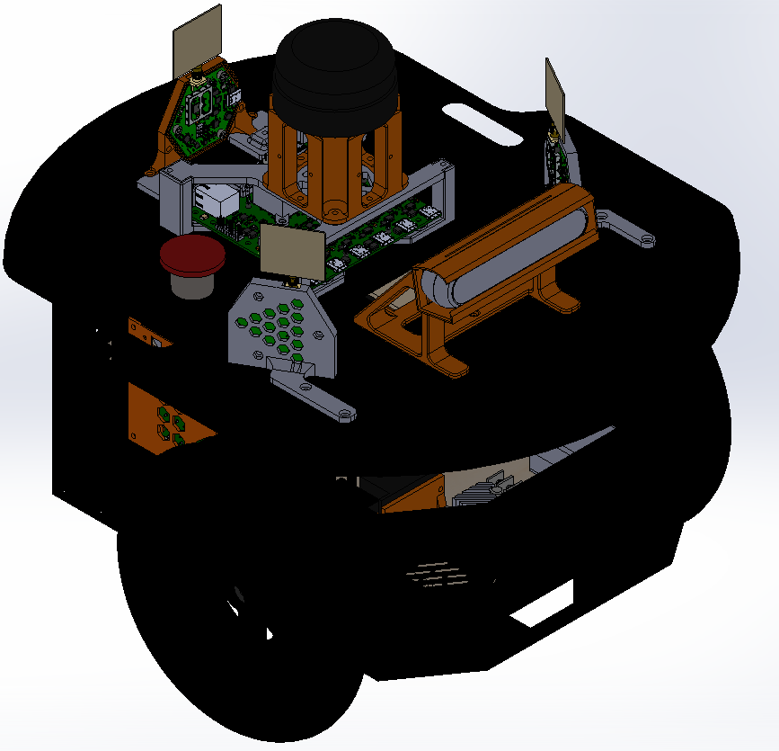

# Pioneer-Mechanical-Update

This repository contains the 3D model of a modified Pioneer 2-DX used by the SwarmUS project.

## Requirements
- Solidworks (I use a 2019-2020 academic version)

### Repository structure

------

```
Pioneer-Mechanical-Update
├── outputs
│   └── dxf
│   └── STL
|   	├── external
│   	└── internal
├── external
├── internal
├── Pioneer_originalRobotBase
├── pioneer2DX.SLDASM
└── README.md
```

#### pioneer2DX.SLDASM

Main assembly of the modified pioneer. It's composed of a Pioneer 3Dx chassis (which is the same as the Pioneer 2Dx) get from *Pioneer_originalRobotBase*, from components that are external to the robot (*external*) and from components that are internal to the robot (*internal*).

In this assembly, the Realsense D455 and its support are used but an additional models were made to use a D435i instead.

Note: The wheels and the front sonar array are not included in the assembly since they are not useful to the sensor and electronic layout. 



### external

Contains the 3D models of the external components and their supports


- **D435i**
  - **D435i_case.sldprt**: Realsense D435i protective case
  - **Intel_RealSense_Depth_Camera_D435.SLDASM**: 3D model of the camera distributed by Realsense [CAD Files (intelrealsense.com)](https://dev.intelrealsense.com/docs/cad-files)
  - **D435i_support.sldprt**: Camera stand that fits on a bolt pattern of the pioneer's top plate. The protective case is compatible with the support.
  - **protected_D435i.SLDASM**: Assembly of the camera and its protective case.
- **D455**
  - **D455_case.sldprt**: Realsense D455 protective case
  - **Intel_RealSense_D455_CAD_external_v2.SLDASM**: 3D model of the camera distributed by Realsense [CAD Files (intelrealsense.com)](https://dev.intelrealsense.com/docs/cad-files)
  - **D455_support.sldprt**: Camera stand that fits on a bolt pattern of the pioneer's top plate. The protective case is compatible with the support.
  - **protected_D455.SLDASM**: Assembly of the camera and its protective case.
- **motor_stop.SLDPRT**
  - Cad of the pushbutton used to stop the motor power. Is mounted in a 22mm hole in Pioneer's top plate.
- **Lidar**
  - **rplidar_simplified.SLDPRT**: 3D model of a simplified Rplidar A2M8.
  - **lidar_support.SLDPRT**: Lidar stand. Our Pioneer 2Dx has already a bolt pattern on its top plate that we reused to save us time.

### internal

Contains the 3D models of the internal components, their supports and big support plate.

- **Battery**

  - **GOOLOO.SLDPRT**: Model of the battery. It's placed at the back of the robot since its the most accessible place in order to remove it and recharge it. 
  - **battery_holder_center.SLDPRT** and **battery_holder_side.SLDPRT**: support of the battery on the internal plate in order to strap the battery with a velcro and to give more room to the wire exiting the battery

- **Support plate**

  

  - **internal_suport_plate_hole.SLDPRT** : Laser cut plate used to screw the components in place.
  - **small_plate_support.SLDPRT**: Small stands used to support the plate near the back of the robot. There are 4 of them and they are screwed on the bolt pattern of the bottom plate of the robot's chassis.
  - **big_plate_support.SLDPRT**: Big stand that can be used to support the front of the plate inside the robot. This part can be 3D printed
    - **big_plate_support.SLDASM (Alternative with a laser cut technology)**: Assembly of four 1/8" 2D cut plate
      - **big_support_long_side_0P125.SLDPRT**: Long side of the box
      - **big_support_small_side_0P125.SLDPRT**: Small side of the box
      - TODO: Need a small bracket to connect the box to the screw holes of the pioneer

- **internal_electronics_plate.SLDASM**: Assembly of the circuits components and the support plate.

  

  - **bornier.SLDPRT**: Screw terminals.
  - **diode_schottky.SLDPRT**: Schottky diode.
  - **REG_313080006.SLDPRT**: 313080006 5V regulator
  - **relay.SLDPRT**: Relay
  - **roboclaw_2X30A.SLDASM**: Motor controller CAD. Got it on : [RoboClaw 2x30A Motor Controller (basicmicro.com)](https://www.basicmicro.com/RoboClaw-2x30A-Motor-Controller_p_9.html)

  

- **Side pannel**

  

  - **computer.SLDPRT**: Box that represents the footprint of  Raspberry Pi 4 and a Jetson Nano ( sizes of their longest side with height of a Jetson)
  - **side_pannel.SLDPRT**: Model of a panel that can be installed on the left-side slot of the pioneer to support a min-plate. In our case, we used is to support the computer.
  - **computer_support.SLDPRT**: Plate that can be screwed on the *side_pannel.SLDPRT* . It has the bolt pattern to install a Rasberry Pi 4 or a Jeston Nano.

### **Pioneer_originalRobotBase**: 

Pioneer 3DX model that I took from:

[MathWorks Robotics and Autonomous Systems Team (2021). Mobile Robot Simulation for Collision Avoidance with Simulink (https://www.mathworks.com/matlabcentral/fileexchange/47208-mobile-robot-simulation-for-collision-avoidance-with-simulink), MATLAB Central File Exchange. Retrieved February 18, 2021.](https://www.mathworks.com/matlabcentral/fileexchange/47208-mobile-robot-simulation-for-collision-avoidance-with-simulink)

I had to redraw the motors(*internal/GM9236S01.SLDPRT*) since the motors were misaligned with their mounting hole in the chassis. 

I only used the main part of the chassis since all the other stuffs are not on our real Pioneer 2Dx.


### Outputs

- STL files of the custom made part in order to 3D print them.
- DXF files of the custom 2D plate. Can be used with a laser cutting machine.

Note: Some files might differ from their original model and they will be updated on the next iteration of the mechanical parts.